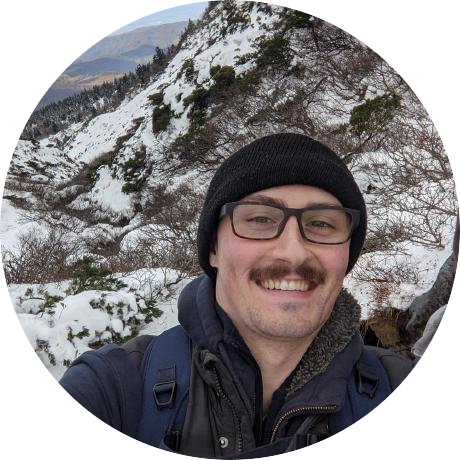

# About me

Hi! I am a programmer from North Carolina pursuing a B.S. in Computer Science. The problems I am most excited to solve are the more under-the-hood or back-of-house kind, so I am especially interested in Server-Side development. I also like tinkering and building projects for my home lab.

Some of my hobbies are writing & recording music, hiking, and reading.
